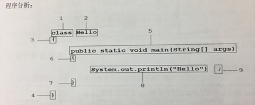

第一个Java程序
------------

Note: 一、编写代码流程

 * 新建文本文档
 * 改名为Hello.java
 * 使用文本编辑器打开Hello.java文件
 * 键入以下代码

```java
public class Hello{
    public static void main(String[] args){
        System.out.print("Hello world");
    }
}
```

- - -

Note: 二、编译代码流程

 * 启动命令行窗口(Win+R)
 * 使用命令行进入源代码所在目录
 * 使用编辑命令: **javac Hello.java**,编译成功后同目录下将出现Hello.class文件
 
- - -

Note: 三、运行代码流程

 * 运行命令: **java Hello.java**
 * 结果将是在控制台输出: Hello world

- - -
 
Note: 四、程序分析



| **序号**  | **代码含义**| 
| -  | --------        |
| 1  | Java程序的开始，表示定义一个类 |
| 2  | 表示定义类的名字，编译后，会产生一个和该名字一直的class文件|
| 3  | 类的开始标志，和4相互对应|
| 4  | 类的结束标志，和3相互对应|
| 5  | 主方法，Java程序的入口，执行Java命令后，程序将自动执行主方法代码，是程序的主入口|
| 6  | 主方法的开始标志，和7对应|
| 7  | 主方法的结束标志，和6对应|
| 8  | 功能执行代码，表示打印一行文本信息:Hello,world|
| 9  | 语句结束符号|

* * *

三大注释方式
------------

Note: Java提供的3种注释类型

| **注释类型**  | **使用说明**          | 
| -  | --------        |
| 单行注释  | //: //注释信息，从//开始到本行结束所有字符都会被编译器忽略 |
| 多行注释  | /* */: /*注释信息 */ 之间的所有字符将会被编译器忽略 |
| 文档注释  | /**  */: /**注释信息 */和多行注释一样，除此之外还可以专门生成文档信息API|

Note: 如下

```java

//注释信息，从//开始到本行结束所有字符都会被编译器忽略 |

/* 
* 多行注释：多用于注释方法
* 1、准备
* 2、发射
* */

public class Hello{
    /**  文档注释:多用于方法注释，用于解释方法与生成说明文档API
    * @param args 
    */
    public static void main(String[] args){
        System.out.print("Hello world");
    }
}

```